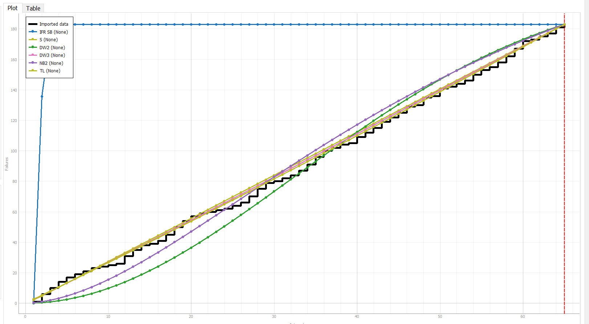
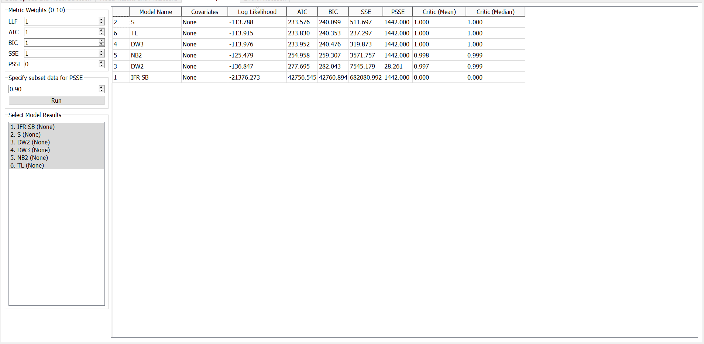
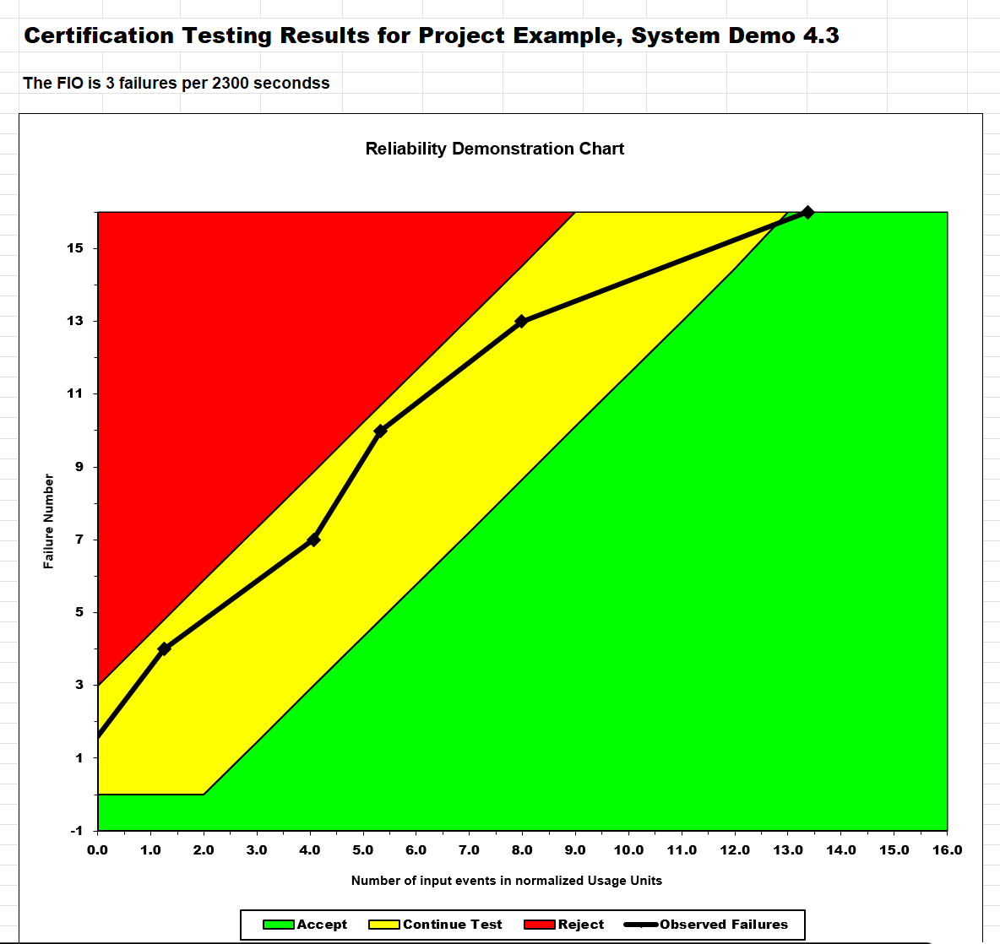
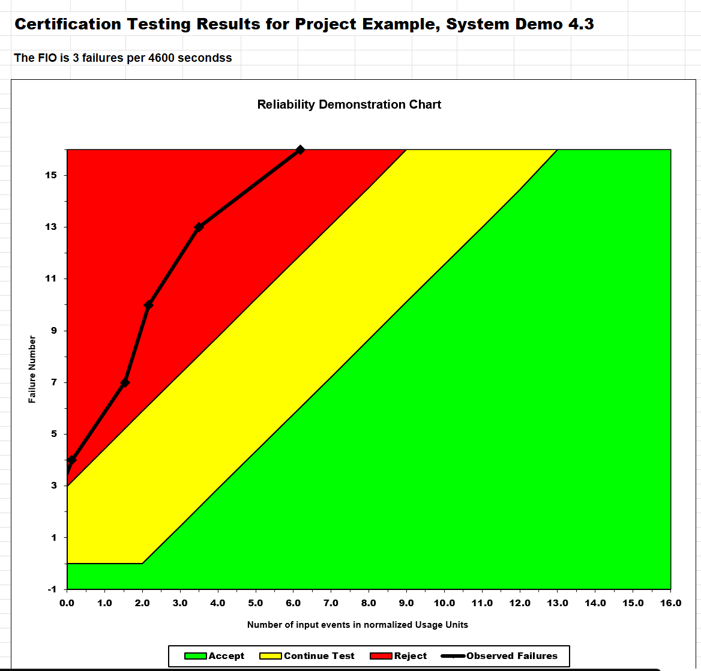
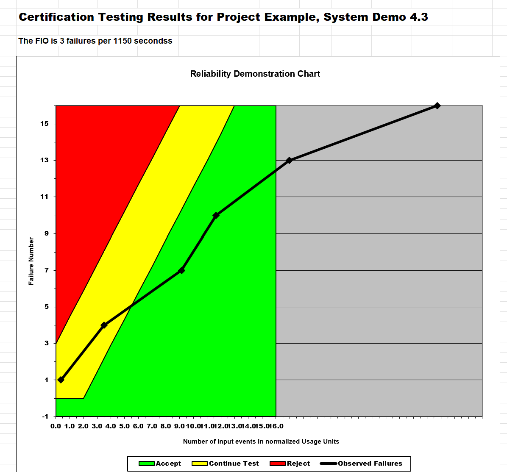

**SENG 438- Software Testing, Reliability, and Quality**

**Lab. Report \#5 – Software Reliability Assessment**

| Group \#:      |  13 |
| -------------- | --- |
| Student Names: | David Tran    |
|                | Bismarck Leung    |
|                | Chachi Han    |
|                | Zirui Wang    |

# Introduction
For this lab, our group was tasked to familiarize ourselves with realiability assessment tools such as C-SFRAT and the Reliability Demonstration Chart. As part of this, we will learn how to use failure reliability growth testing to help analyze a product's change overtime. Additionally, the analysis of failure data can aid in its future prevention. 

# 

# Assessment Using Reliability Growth Testing 

## Results from Model Comparison
For this portion of the assignment, we had to select the 2 best models using the provided datasets. For this portion of the lab, we used dataset 2 and C-SFRAT. Note that because we're using C-SFRAT, we had to convert the given data to the correct format first. 

We first selected all possible comparisions with the covariates. 

Although finding the model that best fits the data could be done through visual inspection, a more standardized approach such as comparing the log-likelihood will be taken instead. To do this, we will enter the Model Comparison tab and sort by Log-Likelihood. 

Through this analysis, we're able to see that S and TL most closely matches our data. 

# Advantage of Reliability Growth Testing 
* The graphs generated by reliability growth analysis can show time-dependent trends, therefore allowing us to predict how the system will behave in the future. 
* It allows us to examine the details of the graph and allow us to change some properties of our input failure data and show the impact of those changes. 
# Disavantage of Reliability Growth Testing 
* The software is not easy to use, it requires an input file in the correct format, and generating plot can take a while to run. This especially applies in analyzing a large amount of data, converting data into the right format may be a hassle, and analyzing them takes even longer.
 * failure prediction is tool dependent, the different software we use might result in different predictions based on the same failure data. 
* in order to generate an accurate prediction, it requires more data entry. 
* Reliability predictions are not always accurate, as it is based on historical data and does not take into account of any external factors that might affect the system. chatgpt refuse to check my grammar whatever it makes the point

# Assessment Using Reliability Demonstration Chart
To analyze the reliability demonstration, we have chosen to use RDC-11 and the data will be taken from Failure Report 2. For each graph, we have set the discrimination ratio (lambda) to 2.00, the developer's risk (alpha) to 0.100, and the user's risk (beta) to 0.100. We chose these values as they are typical and standard for reliability demonstration charts.

## Justification of choosen MTTFmin
To determine the minimal MTTF to make the system acceptable, we tried to calculate a range where the system would be acceptable, based on our calculations, we believe the system would be acceptable with three maximum acceptable numbers of failures. We then had to go through a series of trial and error to find the minimal MTTF of the system. Regarding the failure data, since Failure Report 2 provides a lot of failure data of which the time between each failure is very close, we had to choose data that were more separated apart. Otherwise, the data in the plot would be too close to the origin and it would be hard to analyze. We ended up choosing data that were three failures apart as our plot input.

## Minimum Acceptable MTTFmin
We have decided that having three failures per 2300 seconds will give us the minimal acceptable Mean Time To Failure (MTTF). Since failure data 2's data is based on a second time interval, to calculate MTTFmin we have to convert seconds into minutes; that is, 2300 seconds = 38.333 minutes. The MTTFmin will be 3/38.333 = 0.078261 failures/minute.

## Half Acceptable MTTFmin
The following chart displays half the MTTFmin data. We have doubled the time interval between failures, that is changed the original minimal acceptable mean time to failure from 3 failures in 2300 seconds to 3 failures in 4600 seconds. Similarly, for the minimal acceptable MTTF calculation, 4600 seconds equals 76.666 minutes, and 3/76.666 = 0.0391 failures per minute. By doing so, we have raised the mean time to failure requirement, meaning our system will have to fail less in order to be acceptable, as reflected in the following plot.

## DOuble Acceptable MTTFmin
To double the MTTF, we have chosen to decrease the time interval between failures, from 3 failures per 2300 seconds to 3 failures per 11500 seconds. After calculation, the MTTFmin will be 0.15652 failures per minute. This means we have lowered the standard, and our original plot data will be more acceptable to the standard.

Advantages of RDC: 
RDC analysis using RDC-11 is very easy to use; it simply fills in the failure data and enters the MTTF into the Excel sheet. The program does not require an input file, thus there is no concern about the failure of data formatting. RDC-11 is very lightweight and it generates plots very quickly. The visual plot is very easy to understand and interpret the result. 

Disadvantages of RDC: 
Due to RDC-11 being based on an Excel sheet, and it not taking any input file, it might be an inconvenience to analyze a large amount or multiple data. It only provides whether the system is acceptable or not acceptable; it does not provide much detail on the exact measurement of reliability or availability. RDC does not provide the details of failure or point out what is causing the resulting reliability.
# 

# Comparison of Results
We were able to compare the two parts and determine that part 1 was better for shorter intervals as it shows a chart with covariantes that determine an acceptable failure rate target of the user’s choice with a maximum interval of 99. In comparison to part 2, it can hold a much greater interval of over 200k events. 

As such, when trying to analyze current Reliability, it is better to use RGT as it can identify current faults and eliminate them, and also forecast future reliability. With the model shown, it can measure and achieve a target that is set in a timely manner while being cost effective. 

RBC is more useful near the end of development as it ensures that an FIO is achieved to a certain extent, thus should be done with the finished code.

# Discussion on Similarity and Differences of the Two Techniques

Similarities:
The same dataset can be used for both of these testing methods. 
Both of the methods use failure times and MTTF as its basis.
Both methods utilize some sort of graph to visualize the failure rates.

Differences:
The way that the data is plotted is different and is interpreted differently 
RDC only uses inter-failure times while RGT in addition uses failure count

# How the team work/effort was divided and managed
To start, we all installed the necessary tools for this lab and made sure each member of the team knew how to use each tool. We then split into 2 groups, with Bismarck and David working on Part 1, and Chachi and Zirui working on Part 2. For Part 1, we started by trying SRTAT, but we eventually transitioned to using C-SFRAT despite requiring to convert the files to csvs because we found it easier and more elegant to use. Then, omce all the necessarily data was ran through the tools, we all worked together to compile this lab write-up.
# 

# Difficulties encountered, challenges overcome, and lessons learned
With this lab, a difficulty that we encounter was the incompatibility with MacOS that some of the software had. Of course, this eventually led us to adopt C-SFRAT for the visualization and analysis of the data. However, there was also another challenge that arose with adopting C-SFRAT, and that's the format it required. None of the given data files worked with C-SFRAT by default and required us to convert it by hand ourselves. While this help us hone our data analytic skills more this was a major drawback for a while.
# Comments/feedback on the lab itself
The datafiles were not processed and was not clear how to process them for the software and we weren't sure which dataset to use because it was not written in the instructions. The software also didn't work properly, the one provided by Dr.FAR's models did not run, there were a lot of errors which models and only two ran properly. Overall, very time consuming lab due to unclear instructions.

